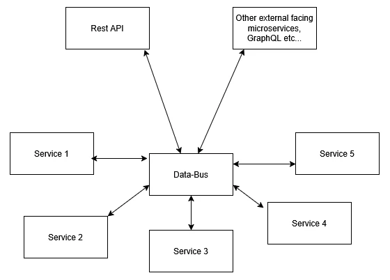

# Notes API Project

Microservice-based notes management system with JWT authentication and message bus.

## 📌 Features

- **User Authentication** (JWT)
- **Notes CRUD Operations**
- **Message Bus Integration** (RabbitMQ)
- **Pagination & Sorting**
- **API Documentation** (OpenAPI 3.0)

## 🚀 API Endpoints

### Authentication

| Method | Endpoint         | Description              |
| ------ | ---------------- | ------------------------ |
| POST   | `/auth/register` | Register new user        |
| POST   | `/auth/login`    | User login               |
| GET    | `/auth/me`       | Get current user profile |

### Notes

| Method | Endpoint      | Description               |
| ------ | ------------- | ------------------------- |
| GET    | `/notes`      | Get all notes (paginated) |
| POST   | `/notes`      | Create new note           |
| GET    | `/notes/{id}` | Get single note by ID     |
| PATCH  | `/notes/{id}` | Update note content       |
| DELETE | `/notes/{id}` | Delete note               |

### System

| Method | Endpoint  | Description         |
| ------ | --------- | ------------------- |
| GET    | `/health` | System health check |

## 🔧 How to run test environment

### Run with Docker

**Requirements**:

- Docker

**Run**

```bash
docker-compose up -d --build
```

In Unix-based systems, you may need to add execute permission to the `init-db.sh` file. To do this simply paste this command into terminal:

```bash
chmod +x ./postgres/init-db.sh
```

### Run manually:

**Requirements**:

- [PostgreSQL Server](https://www.postgresql.org/download/)
- [RabbitMQ](https://www.rabbitmq.com/docs/download)
- [Node.js 22+](https://nodejs.org/en)

Add users and databases to match the data in the `.env.example` file.

**Run**

```bash
npm i
cp .env.example .env
npm run start:all:dev
```

## 🌐 Available Services

| Service         | URL                              | Credentials               |
| --------------- | -------------------------------- | ------------------------- |
| **API**         | `http://localhost:3000`          | -                         |
| **Swagger UI**  | `http://localhost:3000/api-docs` | -                         |
| **RabbitMQ UI** | `http://localhost:15693`         | `admin` / `admin`         |
| **Database**    | `postgres://localhost:5453`      | `notes_user` / `password` |

### Notes

To fully explore API in SwaggerUI, register user using `/auth/register`. Copy token from the response Authorization header, click the green Authorize button on the top and paste the token. Now, you will be able to explore the rest of the features.

- **OpenAPI Specification**:  
  `/docs/openapi.json` (downloadable specification file)

## 💡 Project concept

### 🔄 Basic data flow in the system

1. Outbound Microservices

- Outbound microservices are responsible for communicating with external services through various communication methods or different versions of them. For example, API v1, API v2.

2. Data-Bus as a Central Communication Bus

- The Data-Bus acts as an intermediary between microservices, communicating through a message broker. It contains business logic and manages the flow of data.

3. Data Microservices

- Each microservice is responsible for a specific part of the system's handling and should operate independently. Microservices should not communicate directly to avoid tight coupling. All operations in the system should be managed by the data-bus.

### 🌀 Data flow diagram



### 📦 Project root structure

```
notes-api/
├── apps/ # All the microservices here
│   ├── api-gateway/
│   ├── auth-service/
│   ├── notes-service/
│   ├── users-service/
│   └── ... # Other microservices
├── common/ # Non-standalone code shared across the codebase
├── docs/ # All documentation-related files
│   ├── openapi.json # For example, an OpenAPI specification file
│   ├── other-doc.md # Other documentation files
│   └── ...
├── libs/ # Standalone libraries
├── ... # Project configuration files and folders
└── README.md
```

### 🏭 Base microservice concept

Feel free to structure the service as you need, except for the structure below:

```
some-service/
├── src/ # Main service code
│   ├── contract # Contract module is not imported internally in the service and contains code to connect to this service from other one. Check data-bus service for an instance.
│   └── ... # Other microservices as needed
└── ... # App configuration files
```

### 📡 External-facing microservice

Feel free to structure this service as you need. This microservice doesn't need the contract module since it will be a relay between user and the system. It can contain documentation, such as SwaggerUI for the API Gateway. Check the api-gateway microservice for an instance.
